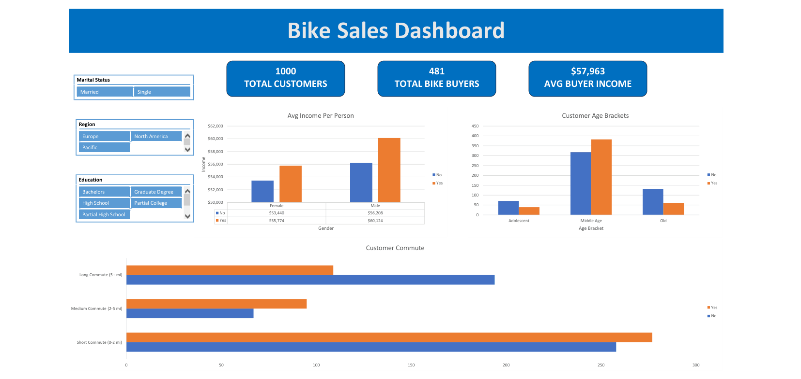

# Bike-Sales-Dashboard
An interactive Excel dashboard analyzing bike buyer demographics, income levels, commute distances, and purchasing behavior.
# Excel Bike Sales Dashboard & Data Analysis

## 📌 Project Overview
This project analyzes customer demographic data to evaluate purchasing patterns and key factors influencing bicycle purchases. Raw customer data was cleaned, transformed with custom features, aggregated through Pivot Tables, and compiled into an interactive Excel Dashboard.

---

## 📊 Dashboard Preview

---

## 🛠️ Data Cleaning & Engineering (Working Sheet)
The raw dataset (`bike_buyers`, 1,026 rows) was processed in the **Working Sheet** (1,000 cleaned records) through the following steps:

1. **Deduplication:** Removed 26 duplicate customer records.
2. **Standardization & Readability:**
   * **Marital Status:** Expanded codes (`M` / `S`) to clear text labels (`Married` / `Single`).
   * **Gender:** Expanded codes (`F` / `M`) to full values (`Female` / `Male`).
   * **Currency & Formatting:** Standardized `Income` as currency values.
3. **Custom Feature Engineering:**
   * **Age Brackets:** Categorized numerical ages into three distinct life stages (`Adolescent`: < 31, `Middle Age`: 31–54, `Old`: 55+).
   * **Commute Category:** Grouped commute distances into simplified ranges (`Short Commute (0-2 mi)`, `Medium Commute (2-5 mi)`, `Long Commute (5+ mi)`).
   * **Income Tier:** Segmented income into `Low Income`, `Middle Income`, and `High Income` tiers for demographic breakdown.

---

## 📈 Analysis & Pivot Table Summaries
Using the transformed data in **Working Sheet**, several Pivot Tables were built:

* **Income vs. Gender & Purchase Behavior:** Compares the average income of buyers vs. non-buyers split by gender.
* **Customer Commute Distribution:** Counts bike buyers across short, medium, and long commute brackets.
* **Customer Age Brackets:** Tracks purchase volume across Adolescent, Middle Age, and Old age groups.
* **KPI Metrics:** Summarizes total customer volume (1,000), total bike buyers (481), overall purchase rate (48.1%), and average buyer income ($57,963).

---

## 🔍 Key Business Insights
* **Income Trend:** Bike buyers have a higher overall average income (~$57,963) compared to non-buyers (~$54,875) across both male and female groups.
* **Age Distribution:** The **Middle Age** demographic accounts for the largest share of total bicycle purchases (383 out of 481 total buyers).
* **Commute Impact:** Customers with **Short Commutes (0–2 miles)** represent the highest volume of bicycle buyers (277 buyers).

---

## 📁 Repository Structure
* `Bike_Sales_Dashboard.xlsx` — Full Excel workbook containing:
  * `bike_buyers`: Raw original dataset.
  * `Working Sheet`: Cleaned data with engineered feature columns (`Age Brackets`, `Commute Category`, `Income Tier`).
  * `Pivot Table`: Aggregated tables and summary metrics powering the visuals.
  * `Dashboard`: Interactive user interface with KPI cards, Pivot Charts, and dynamic Slicers (Marital Status, Region, Education).
* `dashboard.png` — High-resolution preview of the final interactive dashboard.
